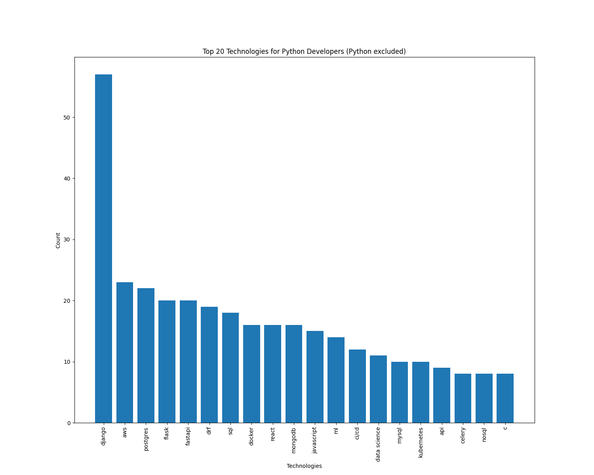

# 🚀 Python Technologies Statistics 📊

## 📖 Overview
This project combines the power of web scraping and data analysis to provide insights into the most demanded technologies in the Python development job market. The statistics are based on Djinni vacancies for Python Developers, offering a real-time snapshot of the industry's technology landscape.

## ✨ Features
- **Scraping & Data Analysis**: The project is divided into two parts - scraping and data analysis, following the Single Responsibility Principle (SRP).
- **Dynamic Technologies List**: There is no predefined list of technologies that the project uses, so technologies are added dynamically.
- **Historical Data**: The project stores and visualizes the history of demanded technologies to track their popularity 
  over time.
- **Async Implementation**: The project uses `Scrapy` that implements concurrency "under the hood" to speed up the 
  scraping 
  process.

## 🚀 Getting Started
1. **Execute the following commands:**
   ```bash
   git clone https://github.com/eduardhabryd/ds-python-technologies-statistics.git
   cd ds-python-technologies-statistics
   python -m venv venv
   source venv/bin/activate # or venv\Scripts\activate in Windows
   pip install -r requirements.txt
   ```
   
2. **Run main.py to scrape the data, clean it and visualize it.**
3. **Find the latest result in the `results` folder.**

## 📊 Sample Results


